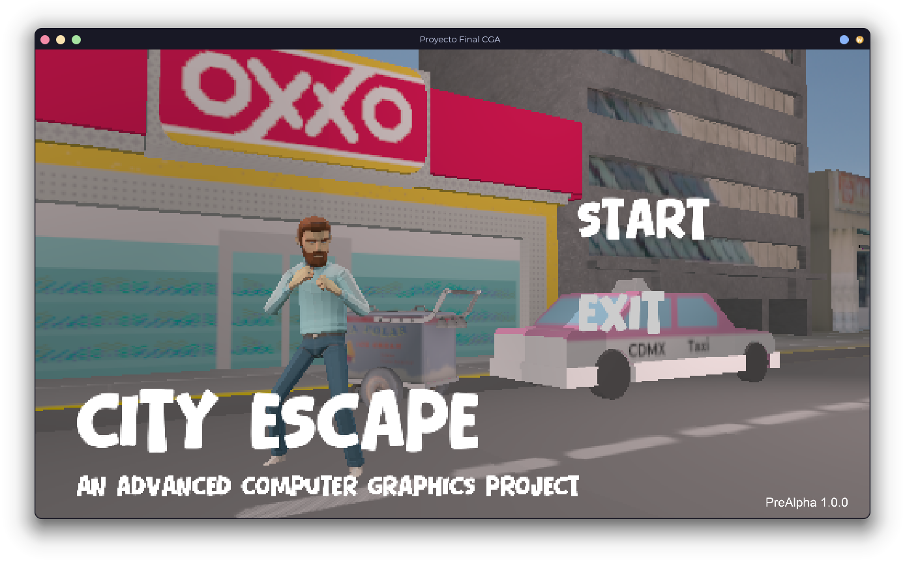
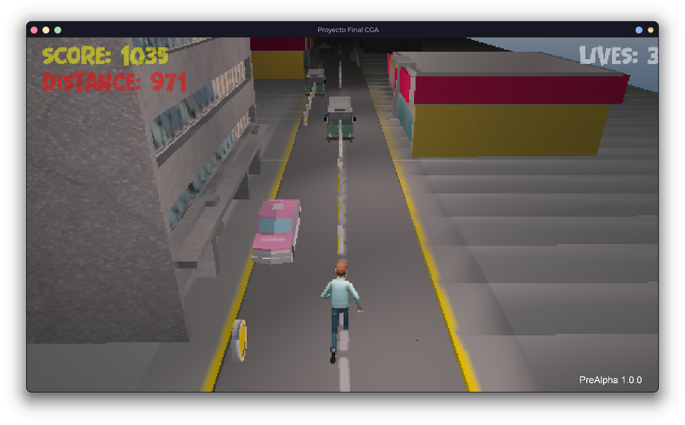
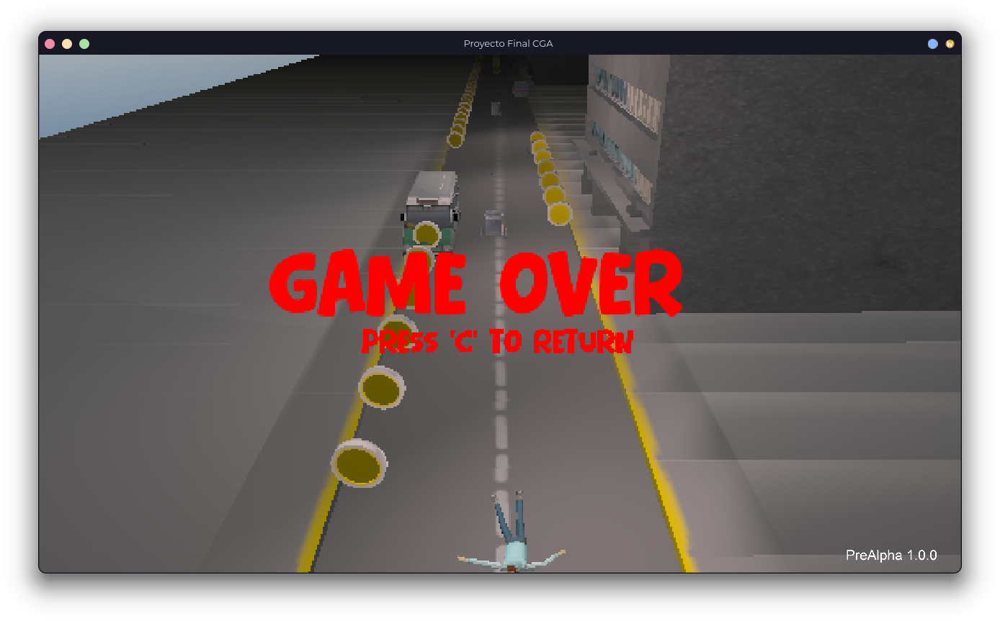

# Proyecto Final - Computación Gráfica Avanzada

```
Semestre 2026-1
Facultad de Ingeniería UNAM
Moreno Chalico Edgar Ulises
```

## Requerimientos de ejecución

Este proyecto requeire de Visual C++ Redistributable v14 disponible en [este enlace](https://aka.ms/vc14/vc_redist.x64.exe).

## Ajustes de compilación

Estos ajustes se pueden configurar de la siguiente manera:

```bash
mkdir build
cd build
cmake .. -DENABLE_LOG=1 -DENABLE_GL_DEBUG=1 -DUSE_DEBUG_ASSETS=1
```

* `ENABLE_LOG`: Habilita algunos logs adicionales para mostrar información relevante en tiempo de ejecución.
* `ENABLE_GL_DEBUG`: Habilita el modo de depuración de OpenGL.
* `USE_DEBUG_ASSETS`: Utiliza los assets directamente sin tener que reconfigurar el proyecto.
* `FETCH_EXTERNAL_ASSIMP`: Descarga, compila y utiliza assimp v6.0.2. Útil para hacer debug de el importado de modelos o
  cualquier cosa que requiera los símbolos de assimp.
* `FIX_ASSIMP_MEMCALL`: Corrige un error de compilación de assimp, habilitar solo si sucede el error.

> [!IMPORTANT]
> En Windows **es necesario** compilar con `FETCH_EXTERNAL_ASSIMP`, ya que la versión de assimp en vcpkg tiene
> errores y los modelos animados no se muestran correctamente.

## Configuración del entorno recomendado

Estas herramientas son para Windows y Linux.

- Compilador: <a href="https://github.com/llvm/llvm-project/releases/tag/llvmorg-20.1.8" href="_blank">Clang (LLVM 20)</a>
- Herramienta de compilación: <a href="https://cmake.org/download/" target="_blank">CMake</a>
- Gestor de paquetes: <a href="https://vcpkg.io/en/getting-started" target="_blank">vcpkg</a>

Instalación de paquetes de vcpkg

```bash
vcpkg install glfw3 opengl glm assimp freetype freeimage stb openal-soft freealut 'imgui[opengl3-binding,glfw-binding]' nlohmann-json
vcpkg integrate install
```

Configuración del proyecto con CMake

```bash
mkdir build
cd build
cmake .. -DCMAKE_TOOLCHAIN_FILE=C:/dev/vcpkg/scripts/buildsystems/vcpkg.cmake -DCMAKE_EXPORT_COMPILE_COMMANDS=ON -DCMAKE_BUILD_TYPE=Debug
```

De ser necesario especificar el compilador, usar el siguiente

```bash
cmake .. -DCMAKE_TOOLCHAIN_FILE=C:/dev/vcpkg/scripts/buildsystems/vcpkg.cmake -DCMAKE_C_COMPILER="C:/Program Files/LLVM/bin/clang.exe" -DCMAKE_CXX_COMPILER="C:/Program Files/LLVM/bin/clang++.exe" -DCMAKE_EXPORT_COMPILE_COMMANDS=ON -DCMAKE_BUILD_TYPE=Debug
```

Nota: Con _CMAKE_EXPORT_COMPILE_COMMANDS_ se puede integrar fácilmente el proyecto a Visual Studio Code (Requiere las
extensiones de CMake y vcpkg)

__Importante__: En la entrega final es __necesario__ compilar con `-DCMAKE_BUILD_TYPE=Release`

Compilación

```bash
cmake --build .
```

## Capturas





]

## Créditos de los modelos 3D utilizados

* [Bearded man - Low poly animated](https://skfb.ly/oqBtx)